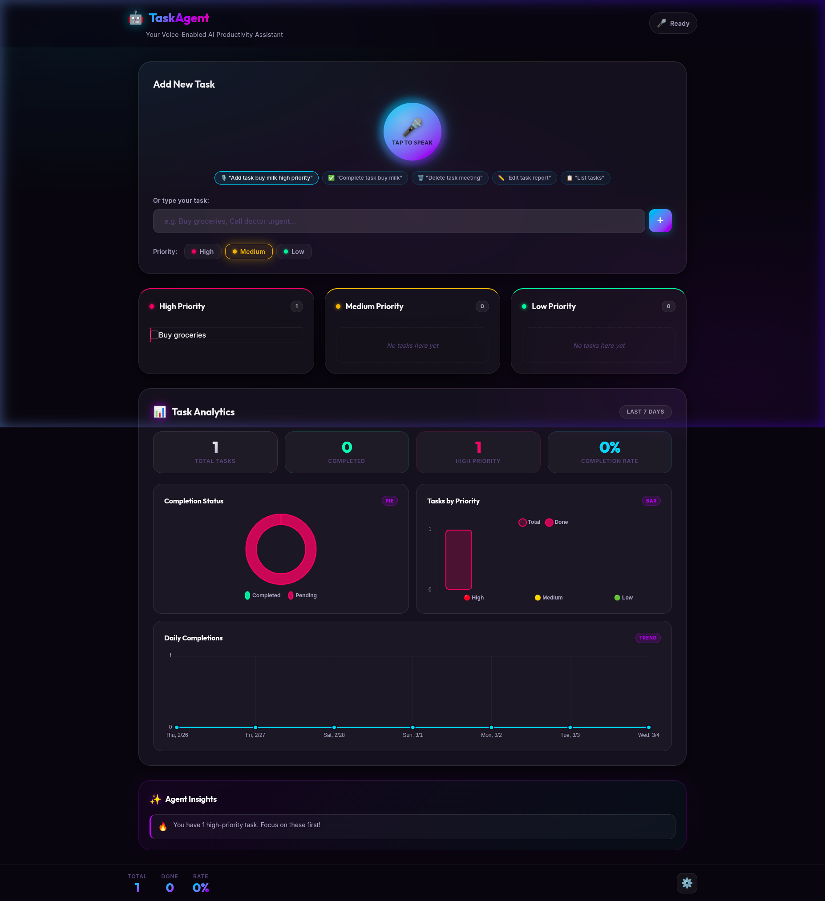
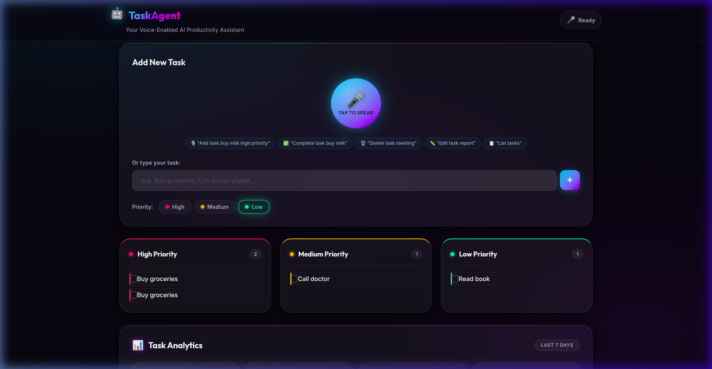
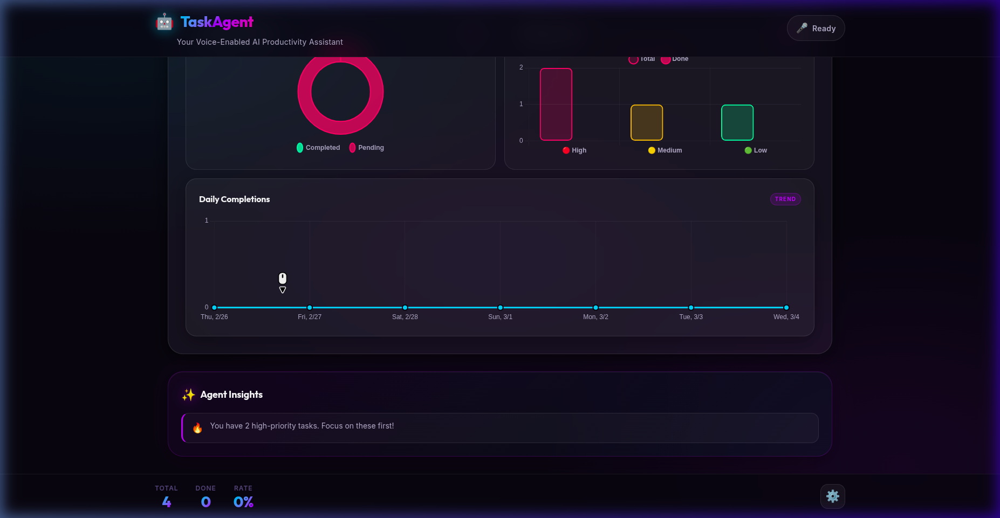
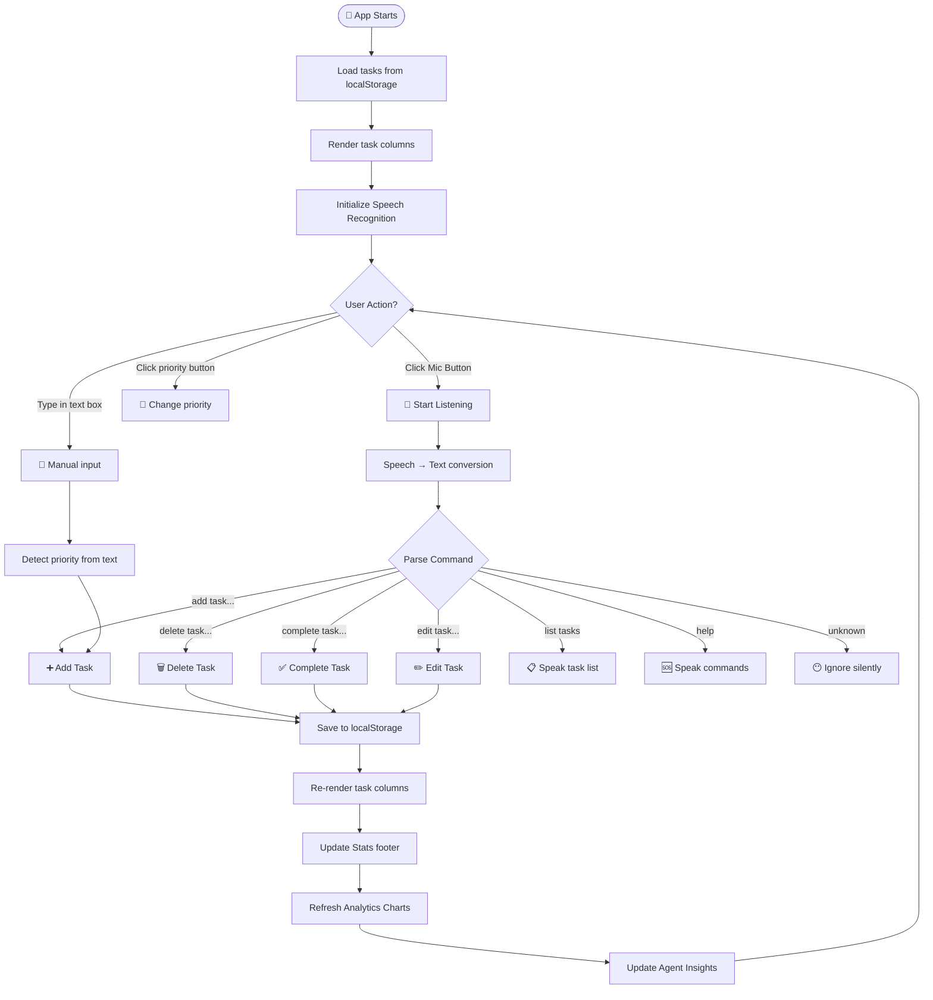
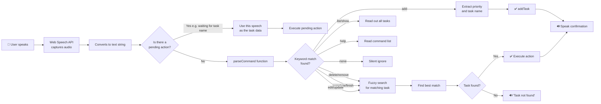
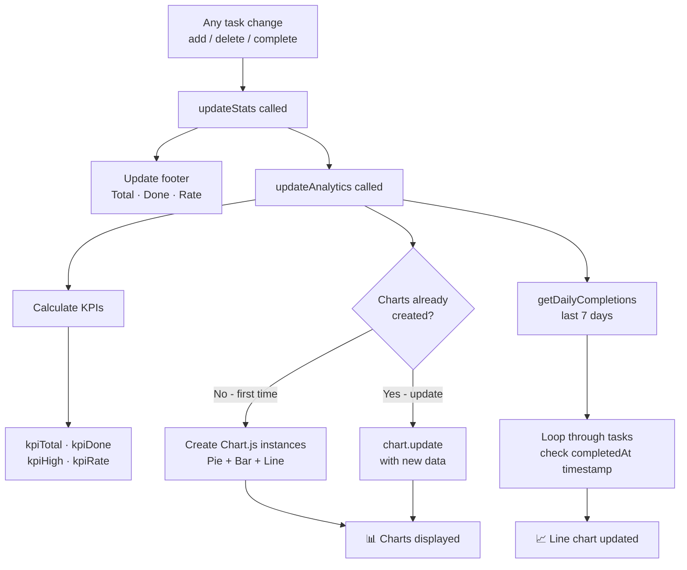

<div align="center">

# 🤖 TaskAgent
### Voice-Enabled AI Task Manager

**A premium, voice-first Progressive Web App to manage your to-dos using natural speech.**  
Talk to it. It listens. It acts. No typing needed.

[](https://tejas-952007.github.io/TaskAgent-Agentic-Task-Manager-with-Voice-UI/)
[](https://github.com/Tejas-952007/TaskAgent-Agentic-Task-Manager-with-Voice-UI/stargazers)
[](LICENSE)

</div>

---

## 📸 Screenshots

### 🏠 Main Dashboard

*The main screen — glowing mic orb, voice hint chips, priority selector, task columns, analytics & insights.*

### ✅ Tasks in Action

*Three tasks added (High / Medium / Low priority) — each card has a colour-coded border and animated entry.*

### 📊 Analytics Dashboard

*Real-time charts update automatically every time you add, complete or delete a task.*

---

## 📚 Table of Contents

1. [What is TaskAgent?](#-what-is-taskagent)
2. [What's New — Changes Made](#-whats-new--changes-made)
3. [How the App Works — Flowchart](#-how-the-app-works--flowchart)
4. [Voice Command Guide](#-voice-command-guide)
5. [Analytics Charts Guide](#-analytics-charts-guide)
6. [Tech Stack](#%EF%B8%8F-tech-stack)
7. [Getting Started (Beginner Friendly)](#-getting-started-beginner-friendly)
8. [Project File Structure](#-project-file-structure)
9. [Deployment](#-deployment)
10. [Contributing](#-contributing)

---

## 🤔 What is TaskAgent?

TaskAgent is a **task manager you talk to**. Instead of clicking buttons and typing text, you simply **speak** and the app understands you:

> 🎤 *"Add task buy milk high priority"*  
> 🤖 *"Got it! Task added."*

> 🎤 *"Complete task buy milk"*  
> 🤖 *"Task marked as done!"*

It runs **100% in your browser** — no apps to install, no accounts needed, no internet required after first load (it's a PWA).

---

## ✨ What's New — Changes Made

This section explains **every improvement** made to the original project, in simple language.

---

### 1. 🎨 Premium UI / UX Redesign

**What was changed:** The entire look of the app was redesigned from scratch.

| Before | After |
|--------|-------|
| Basic dark background | **Animated ambient glow** background (cyan + purple radial lights) |
| System default fonts | **Outfit + Inter** fonts from Google Fonts |
| Plain card panels | **Glassmorphism** cards (frosted glass effect with blur) |
| Simple mic button | **Glowing orb** mic button with animated pulse ring |
| No visual hierarchy | **Color-coded** task columns with glowing priority dots |

**Files changed:** `style.css`, `index.html`

---

### 2. 🎤 Improved Voice Commands

**What was changed:** Voice recognition was made smarter and faster.

#### New voice commands added:
| Command | Example | What it does |
|---------|---------|--------------|
| ✅ **Edit task** | *"Edit task meeting"* | Opens edit prompt for that task |
| 🗑️ **Cancel/Discard** | *"Cancel task report"* | Alternative way to delete |
| 📋 **Help** | *"What can you do?"* | Lists all commands |

#### Priority now includes **Medium**:
Before, you could only say "high priority" or "low priority."  
Now: **"medium priority"**, **"normal priority"**, **"medium"** all work.

#### Faster one-shot commands:
Old: Say "add task" → wait for prompt → say task name (2 steps)  
New: Say **"add task buy milk high priority"** — done in **one sentence!** ✅

**Files changed:** `script.js`

---

### 3. 📊 Analytics Dashboard (Brand New!)

**What was added:** A full statistics section with 3 live charts, built using **Chart.js**.

This was **not in the original project at all** — it's a completely new feature.

**File created:** `analytics.js` (new file)  
**File changed:** `index.html`, `style.css`

See the [Analytics Charts Guide](#-analytics-charts-guide) section below for details.

---

### 4. 💡 Voice Command Chips (Hint Row)

**What was added:** A row of small pill-shaped hints showing example voice commands right on the screen.

```
🎙️ "Add task buy milk high priority"   ✅ "Complete task buy milk"   🗑️ "Delete task meeting"   ✏️ "Edit task report"   📋 "List tasks"
```

**Why:** New users had no idea what to say. Now they can see examples instantly.

**Files changed:** `index.html`, `style.css`

---

### 5. ⚡ Performance & UX Improvements

- Task animations: tasks **slide in with a bounce** when added, and **slide right and fade** when deleted
- Mic button changes colour: **cyan/purple** = idle, **green pulse** = listening, **shimmer** = processing
- Custom checkbox: replaced plain HTML checkbox with a **gradient ✓ checkbox**
- Settings modal: toggle switches now use a **glowing slide toggle** instead of plain checkboxes
- **Hindi language** option added in settings

---

## 🔄 How the App Works — Flowchart

### Overall App Flow



---

### Voice Command Processing Flow



---

### Analytics Data Flow



---

## 🎙️ Voice Command Guide

> **Tip:** Use **Chrome** or **Edge** browser for best voice recognition.

### How to use voice:
1. Click the **glowing mic button** (or tap on mobile)
2. Wait for it to turn **green** (listening)
3. Say your command clearly
4. The app responds with voice + visual update

---

### Complete command list:

#### ➕ Add a Task
```
"Add task [task name]"
"Add task [task name] [priority] priority"
"Remember to [task name]"
"Remind me to [task name]"
```
**Examples:**
- *"Add task buy groceries"*
- *"Add task call doctor high priority"*
- *"Remember to submit the report"*

---

#### ✅ Complete a Task
```
"Complete task [task name]"
"Mark done [task name]"
"Finish [task name]"
```
**Examples:**
- *"Complete task buy groceries"*
- *"Mark done call doctor"*

---

#### 🗑️ Delete a Task
```
"Delete task [task name]"
"Remove task [task name]"
"Delete [task name]"
```
**Examples:**
- *"Delete task meeting"*
- *"Remove task call doctor"*

---

#### ✏️ Edit a Task
```
"Edit task [task name]"
"Update task [task name]"
"Modify task [task name]"
```
**Examples:**
- *"Edit task report"*

---

#### 📋 List All Tasks
```
"List tasks"
"Show tasks"
"What do I have?"
"Read tasks"
```

#### 🆘 Help
```
"Help"
"What can you do?"
"Commands"
```

---

### Priority keywords you can say:
| Priority | Words that work |
|----------|----------------|
| 🔴 **High** | `high priority`, `urgent`, `important`, `critical` |
| 🟡 **Medium** | `medium priority`, `normal`, `medium`, `moderate` |
| 🟢 **Low** | `low priority`, `low`, `minor`, `whenever` |

---

## 📊 Analytics Charts Guide

The **Task Analytics** section appears below the task columns and updates automatically.

### KPI Cards (the 4 number boxes)

| Card | Colour | What it shows |
|------|--------|---------------|
| **Total Tasks** | White | All tasks you've ever added |
| **Completed** | 🟢 Mint | Tasks you've marked as done |
| **High Priority** | 🔴 Red | Tasks marked as high priority |
| **Completion Rate** | 🔵 Cyan | % of total tasks completed |

---

### Chart 1 — 🍩 Completion Status (Doughnut)


- **Pink/Red** = Pending tasks (not done yet)
- **Mint/Green** = Completed tasks
- Hover over a section to see the count

---

### Chart 2 — 📊 Tasks by Priority (Bar Chart)

- Groups tasks by **High / Medium / Low**
- Each group shows **2 bars**:
  - Transparent bar = **Total** tasks in that priority
  - Solid bar = **Done** tasks in that priority
- Colours: 🔴 Red (High) · 🟡 Gold (Medium) · 🟢 Mint (Low)

---

### Chart 3 — 📈 Daily Completions (Line Chart)

- Shows the **last 7 days** on the X axis (e.g. Mon, Tue… Sun)
- Y axis = how many tasks you completed that day
- **Cyan line** with a gradient fill below
- Points glow when you hover over them

---

## 🛠️ Tech Stack

| What | Technology | Why |
|------|-----------|-----|
| **Structure** | HTML5 | Defines all page elements |
| **Styling** | CSS3 + Custom Properties | Glassmorphism, animations, design system |
| **Logic** | Vanilla JavaScript | Voice, tasks, storage — zero frameworks |
| **Voice Input** | Web Speech API | Browser-native speech recognition |
| **Voice Output** | Web Speech Synthesis API | Text-to-speech confirmations |
| **Charts** | Chart.js 4.4 | Pie, bar, and line charts |
| **Fonts** | Google Fonts (Outfit + Inter) | Premium typography |
| **Offline** | Service Worker (`sw.js`) | Works without internet |
| **Storage** | localStorage | Tasks saved in your browser |
| **PWA** | `manifest.json` | Installable as a mobile app |

---

## 🚀 Getting Started (Beginner Friendly)

### Step 1 — You need:
- A computer with **Google Chrome** or **Microsoft Edge** browser
- That's it! No Node.js, no Python, no server needed.

---

### Step 2 — Download the project

**Option A — Download ZIP (easiest):**
1. Go to: https://github.com/Tejas-952007/TaskAgent-Agentic-Task-Manager-with-Voice-UI
2. Click the green **"Code"** button
3. Click **"Download ZIP"**
4. Unzip the downloaded file

**Option B — Git clone:**
```bash
git clone https://github.com/Tejas-952007/TaskAgent-Agentic-Task-Manager-with-Voice-UI.git
cd TaskAgent-Agentic-Task-Manager-with-Voice-UI
```

---

### Step 3 — Open the app

Simply double-click `index.html` — it opens in your browser!

> ⚠️ **Note:** Voice commands need microphone permission. Chrome will ask you — click **"Allow"**.

---

### Step 4 — Use it!

| Task | How |
|------|-----|
| Add a task by voice | Click mic button → say *"Add task buy milk"* |
| Add a task by typing | Type in the text box → press Enter or click **+** |
| Set priority | Click **High / Medium / Low** before adding |
| Complete a task | Click the checkbox ☑️ next to the task |
| Delete a task | Hover over a task → click the 🗑️ button |
| Edit a task | Hover over a task → click the ✏️ button |
| View analytics | Scroll down to the charts section |
| Settings | Click ⚙️ in the bottom-right corner |

---

### Step 5 — Serve locally (for PWA + microphone over HTTPS)

If voice doesn't work from a plain file, run a local server:

```bash
# If you have Node.js installed:
npx http-server . -p 8080

# Then open: http://localhost:8080
```

---

## 📁 Project File Structure

```
TaskAgent-Agentic-Task-Manager-with-Voice-UI/
│
├── 📄 index.html          ← Main HTML page (full app structure)
├── 🎨 style.css           ← All CSS styling (design system)
├── ⚙️  script.js           ← Main JavaScript (voice, tasks, UI)
├── 📊 analytics.js        ← NEW: Chart.js analytics module
├── 📦 manifest.json       ← PWA configuration (install as app)
├── 🔧 sw.js               ← Service Worker (offline support)
├── 🖼️  screenshots/        ← NEW: App screenshots for README
│   ├── dashboard.png
│   ├── tasks.png
│   └── analytics.png
└── 📘 README.md           ← This file!
```

### What each file does:

| File | Beginner explanation |
|------|---------------------|
| `index.html` | The skeleton of the page — defines every button, chart, input, and section |
| `style.css` | Makes everything look beautiful — colors, fonts, animations, glass effects |
| `script.js` | The brain — handles voice commands, adding/deleting/completing tasks, saving data |
| `analytics.js` | Draws the 3 charts (pie, bar, line) using Chart.js |
| `sw.js` | Runs in the background so the app works even when you're offline |
| `manifest.json` | Lets users "install" the app to their phone home screen |

---

## 🌐 Deployment

### Deploy on GitHub Pages (free, instant):

1. Push your code to GitHub
2. Go to your repo → **Settings** → **Pages**
3. Source: **Deploy from branch** → **main** → **/ (root)**
4. Click **Save**
5. Your app is live at: `https://yourusername.github.io/repo-name/`

> ⚠️ GitHub Pages provides HTTPS automatically — this means voice commands will work!

---

## 🤝 Contributing

Want to improve TaskAgent? Here's how:

1. **Fork** this repository (click Fork on GitHub)
2. Create a branch: `git checkout -b feature/my-new-feature`
3. Make your changes
4. Commit: `git commit -m "Add: my new feature"`
5. Push: `git push origin feature/my-new-feature`
6. Open a **Pull Request** on GitHub

### Ideas for future contributions:
- 🌙 Due dates and reminders
- 🏷️ Task categories / tags
- 🌍 More language support
- 🔔 Browser notifications for deadlines
- 📱 Better mobile layout

---

## 📝 License

This project is available under the [MIT License](LICENSE) — free to use, modify, and share.

---

<div align="center">

Made with ❤️ by [Tejas](https://github.com/Tejas-952007) &nbsp;|&nbsp; Originally by [ChaitanyaG93](https://github.com/ChaitanyaG93)

⭐ **Star this repo if you found it useful!** ⭐

</div>
